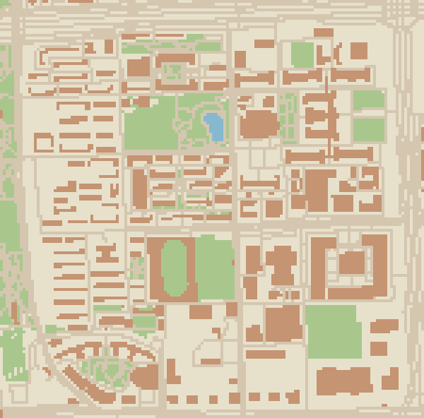

# 北航模拟器

以北航校园为背景的单人 2D 校园生活游戏。当前处于设计和地图准备阶段，尚未包含可运行游戏；3D 版本保留为未来拓展方向。

## 二维地图

已经将学院路、沙河、杭州国际校园的地图轮廓转换为二维局部坐标、SVG 底图、Tiled 瓦片地图和碰撞初稿。这里的“三维原始数据”实际是上游三维场景使用的 OSM/GeoJSON 地图数据，没有导入或生成完整三维模型。



上图是示意瓦片，不是正式像素美术。打开本地 `地图预览.html` 可切换三个校区并查看精确 SVG 轮廓。

| 校区 | 网格尺寸 | 二维要素 |
| --- | --- | --- |
| 学院路 | 150×148 | 869 |
| 沙河 | 160×154 | 340 |
| 杭州国际校园 | 98×161 | 142 |

默认每格 8 米，32×32 像素；x 向东、y 向南。沙河和杭州按北航校园边界包围矩形取景，学院路沿用上游 bbox。范围内仍可能包含校外要素。碰撞层是单元中心采样结果，入口、狭窄通道、门禁和整体楼群重叠需要人工编辑。

## 使用与复现

Python 3 即可，无第三方依赖：

```sh
python tools/convert_maps.py
```

可选参数：`--meters-per-tile 4 --pixels-per-meter 8`。转换会覆盖生成数据，人工游戏地图请另存。

使用 Tiled 打开 `地图数据/二维版本/*.tmj`，图集 `tiles.png` 已包含。地面为 `ground`，碰撞初稿为默认隐藏的 `collision_draft`，人工添加出生点、入口和任务点使用 `gameplay_manual` 对象层。

详细数据结构和限制见 [二维地图说明](地图数据/二维版本/README.md)。

## 游戏方向

探索校园、安排学习和社交、加入社团、制作作品、布置宿舍。先做七天迎新周：三位虚构伙伴、三个简化室内、两条项目路线和最后的作品展示。

- [游戏基础玩法与制作评估](游戏基础玩法与制作评估.md)：2D 主方案和工期估算。
- [3D 版本拓展方案](3D版本拓展方案.md)：先前第三人称开放世界方案。

## 目录

- `地图数据/原始OSM/`：三个校区的原始地图 XML。
- `地图数据/GeoJSON/`：上游处理后的地图轮廓与属性。
- `地图数据/二维版本/`：二维坐标、底图、瓦片、碰撞和转换清单。
- `地图数据/下载清单.json`：固定提交、下载时间、文件大小与 SHA-256。
- `参考资料/`：上游 README 和建模精度说明。
- `tools/convert_maps.py`：二维数据生成工具。
- `地图预览.html`：本地地图查看页面。

## 来源与许可

上游：https://github.com/MrRoam/buaa-xueyuan-campus-3d

固定提交：`6ba98eeb4c50445e49a0e2b1a832bab4eb4fe7d9`。

© OpenStreetMap contributors · [ODbL 1.0](https://opendatacommons.org/licenses/odbl/1-0/)。地图及派生数据保留来源、属性和许可。新增工具和项目文档采用 MIT；上游文档保留原许可。详情见 [DATA_LICENSE.md](DATA_LICENSE.md)。

保留原始文件，后续游戏专用地图另存；当前数据不是高精度测绘成果，也不包含校园完整室内。制作独立人物、对话和美术，不使用其他游戏的素材。
